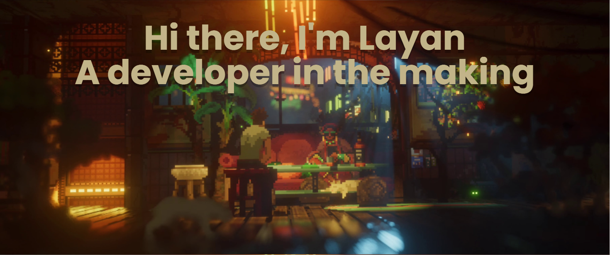

  
  <a href="https://github.com/LayanOliveira">

 
  
  
  
  
  
  
  
  
  <!--  -->
  
  
  <!--  -->
  

 

  
   
  
  
  <!--  -->
  <!--  -->
  <!--  -->
  

<<<<<<< HEAD

  <!--  -->
=======
  
  
>>>>>>> 5a548ccb92fc2cb71916da2d1c845fe55d011b9b
  

  
Credits: <a href="https://github.com/anuraghazra/github-readme-stats">Anurag Hazra</a> e <a href="https://github.com/DenverCoder1/github-readme-streak-stats">DenverCoder1</a>
   <!-- <a href="https://github.com/Platane/snk">Platane</a> -->
   

